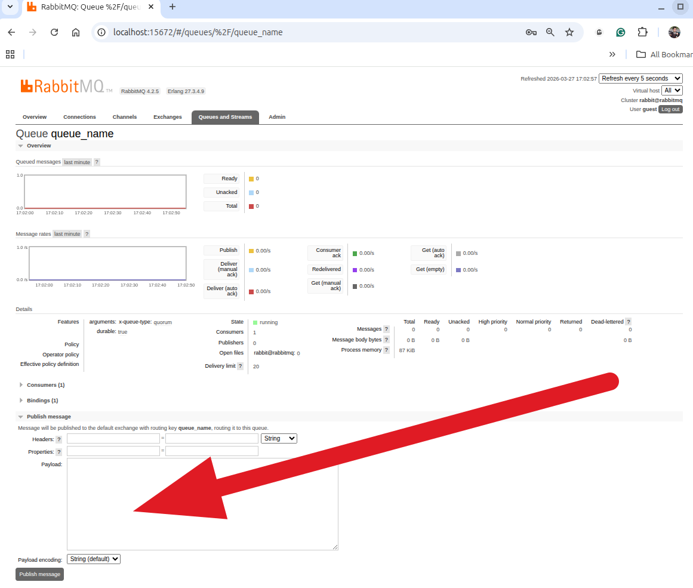

# Simple example of working with RabbitMQ in Laravel 13

<!-- TOC -->
  * [Installation](#installation)
  * [Testing sending and receiving messages](#testing-sending-and-receiving-messages)
  * [RabbitMQ web interface:](#rabbitmq-web-interface)
  * [RabbitMQ console](#rabbitmq-console)
  * [Brief explanation of the logic](#brief-explanation-of-the-logic)
<!-- TOC -->

## Installation

1. Clone this repository (https://github.com/bibrkacity/laravel-13-rabbitmq.git) and `cd` into root folder (*your-path*/laravel-13-rabbitmq)
2. Copy `.env.example` to `.env`
3. Run `composer install`
4. Run `./vendor/bin/sail up`
5. Run `./vendor/bin/sail artisan migrate`
6. Run `./vendor/bin/sail artisan schedule:work` command
7. Run `./vendor/bin/sail artisan queue:work --queue=rabbitmq_test --timeout=0` command in another terminal
8. Run `./vendor/bin/sail artisan app:rabbit` command in third terminal


## Testing sending and receiving messages

Open the url http://localhost:8080/test, and you will see the form of sending the text message.

After sending the message, you will see the message in the storage/laravel.log file

## RabbitMQ web interface:

You can go http://localhost:15672/ by your browser. Type login/password guest/guest and you will see the RabbitMQ web interface.
For example, you can send a message to the queue "queue_name":



This message also must arrive in the storage/laravel.log file.

## RabbitMQ console

If you use Ubuntu or Mint, you can use the RabbitMQ console by running the following command:

`docker exec -it laravel-13-rabbitmq-rabbitmq-1  /bin/bash`

## Brief explanation of the logic

There is a queue with name `config('database.connections.rabbitmq.queue')` ("rabbitmq_test") for run the job for receiving messages from RabbitMQ queue with name "queue_name". 
The queue "rabbitmq_test" is not based on the rabbitmq queue driver. It uses a `database` driver, may be other.

This query runs by command `./vendor/bin/sail artisan queue:work --queue=rabbitmq_test --timeout=0`  with timeout=0, it means unlimited, and dispatches the job `app/Jobs/RabbitMqInitQueueJob.php`. This query is monitoring by the `app/Console/Commands/RabbitMqMonitor.php` command every minute by schedule. If the query fails, the command will log the error message. 

The local experiment shows that this queue can work for several hours.

The job `app/Jobs/RabbitMqInitQueueJob.php` is responsible for receiving messages from RabbitMQ queue with name "queue_name". It consumes messages from the queue and runs callback closure:

```php
        $callback = function ($msg) {
            QueueNameGetMessage::dispatch($msg);
        };
```

As you can see, the callback closure dispatches the event `QueueNameGetMessage` with the message. It is the event that is listening by the `app/Listeners/QueueNameGetMessageListener.php` listener. It has the logic of the message processing. It this example it is just writing the message to the storage/laravel.log file.


